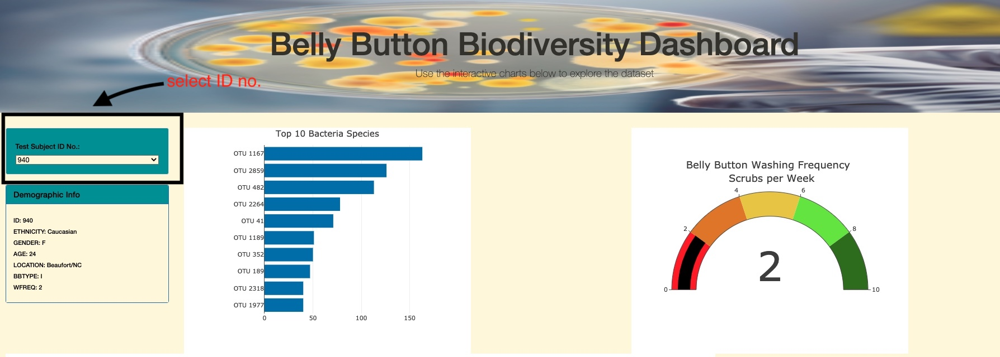
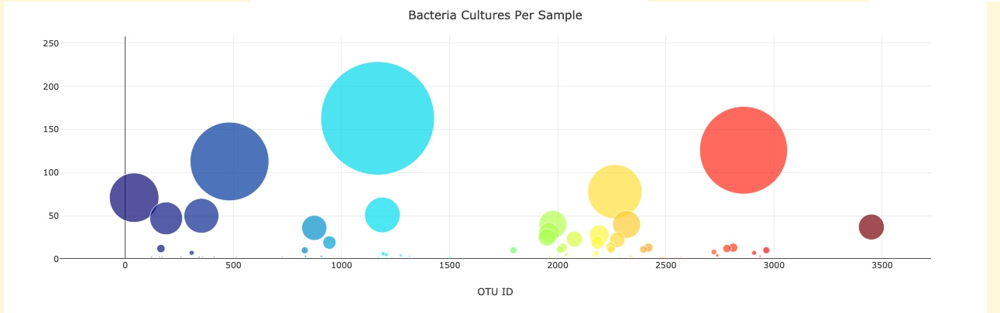

# Bellybutton_biodiversity

Click here to be directed to the dashbard https://jose-monagas.github.io/Bellybutton_biodiversity/

## Overview 

The purpose of this project is to create a dashboard that contains a panel with demographic information as well as a dynamic bar, gauge, and bubble charts to help visualize the bacterial data for several volunteers and be able to identify the top ten bacterial species in their navels. That way, if Improbable Beef identifies a species as a candidate to manufacture synthetic beef, the volunteer will be able to identify whether that species is present in their navel.

## Results 
When an ID number is selected from the dropdown-list (as shown below), a series of graphs are automatically populated displaying the data for that specific volunteer.

